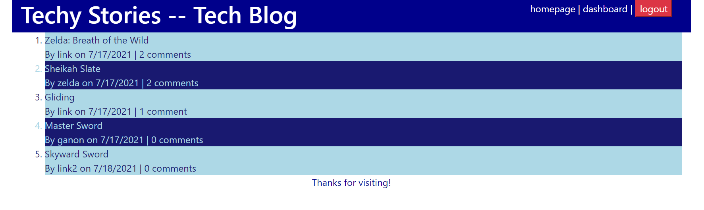

  # techy_stories
  * 

  ## Description
  Techy Stories is a blog for people to come and blog about any kind of tech.  Users can share their opinions through posts and comments on other users' posts. Created through Node utilizing express, MySQL, and Heroku to deploy.

  ## Table of Contents
  * [Installation](#installation)
  * [Usage](#usage)
  * [Deployed-Application-Link](#deployed-application-link)
  * [Deployed-Application-Screenshot](#deployed-application-screenshot)
  * [Contributing](#contributing)
  * [Questions](#questions)
  * [License](#license)

  
  ## Installation
  *  Clone the repo
  *  npm init and npm install to get everything going.
  *  Create a .env file with appropriate MySQL info.
  
  
  ## Usage
  Follow the link to the deploye application.  Then start posting and commenting on others posts.
  
  
  ## Deployed-Application-Link
  
  https://frozen-inlet-37916.herokuapp.com/post/2
  
  
  ## Deployed-Application-Screenshot
  
  
  
  
  ## Contributing
  Others can contribute by cloning the repo and improving where they see fit.  Please reach out via info in Questions section with improvements.
  
  
  ## Questions
  GitHub: [J2021T](https://github.com/J2021T)

  EMAIL: [jordan.turcott@gmail.com](mailto:jordan.turcott@gmail.com)
  
  
  ## License
  This project is covered under the [MIT](../assets/license-files/MIT.txt) license.

 
  
  
